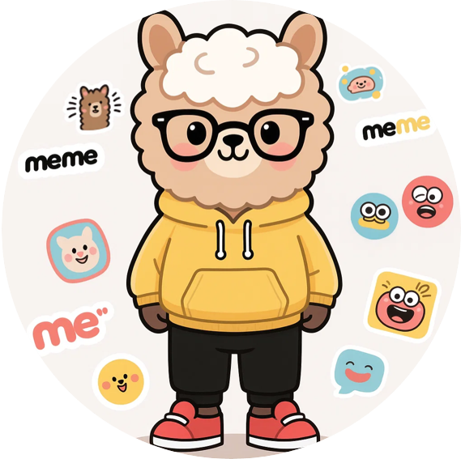
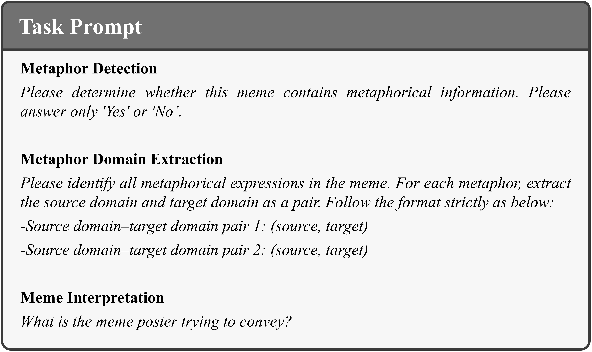

    <h1 align="center">
        
        <b><em>MetaGPT: A Large Vision-Language Model for Meme Metaphor Understanding</em></b>
    </h1>
    
    
    
      
    
    <h2 align="center"><em>Accepted By AAAI 2026!</em></h2>

  

      🌈 We introduce <strong>MetaGPT</strong>, the first vision-language model specifically designed for meme metaphor understanding. MetaGPT is capable of identifying and extracting metaphors in memes, and generating accurate meme interpretations. Furthermore, we construct a dedicated dataset for meme understanding, <strong>MUnd</strong>. Based on MUnd, we further propose an evaluation benchmark for meme understanding and conduct a comprehensive assessment of existing VLMs. Experimental results reveal that current models still face challenges in metaphor comprehension, while MetaGPT consistently outperforms them across all tasks, highlighting its potential in advancing meme understanding. Our code and appendix are available in the supplementary materials.
  

## 🖼️ Datasets

The image sources are available in the following referenced works.

🥽 [**MET-Meme**](https://github.com/liaolianfoka/MET-Meme-A-Multi-modal-Meme-Dataset-Rich-in-Metaphors)

🥽 [**MEMECAP**](https://github.com/eujhwang/meme-cap)

The MUnd dataset and the benchmark test set can be accessed via the links below.

🤗 <a href="https://huggingface.co/collections/MM-ZY/mund-datasets">**Datasets and Benchmark**</a>

### Example

  

## 🤖 Model

we build our project based on the [LLaVA](https://github.com/haotian-liu/LLaVA) codebase, using "LLaVA-v1.5-7B" as the backbone model. After training, we obtain MetaGPT.

## 💯 Evaluation

For evaluation, we provide the code for the metaphor domain extraction task under `eval/META_EXTRACT.py`.

Your prediction results must follow the same format as the ground truth.

Our evaluation prompt is shown below.

  

## 🫶🏻 Acknowledgement

- [**LLava**](https://github.com/haotian-liu/LLaVA)
- [**MET-Meme**](https://github.com/liaolianfoka/MET-Meme-A-Multi-modal-Meme-Dataset-Rich-in-Metaphors)
- [**MEMECAP**](https://github.com/eujhwang/meme-cap)
